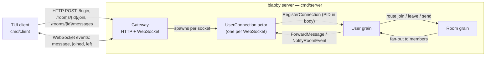

# blabby

A small, real-time group-chat system built on [Proto.Actor](https://proto.actor/) virtual actors (grains) in Go — designed to be **read**, not just run. blabby is a reference implementation that shows how the grain model maps onto identity-bearing entities (a user, a room), how a stateless gateway bridges plain HTTP/WebSocket clients to a cluster of grains, and how the pieces fit together end to end with a terminal client you can drive in a couple of minutes.

What makes it worth a look:

- **Grain-per-entity modelling.** Each user and each room is a virtual actor with single-threaded state — no locks, no shared mutable maps. Commands route through a user's own grain to room grains.
- **A clean client contract.** HTTP POST for commands, a WebSocket for the real-time event stream, JSON on the wire, JWT for identity.
- **Decisions written down.** Non-obvious choices live in [Architecture Decision Records](docs/adr/), each with context and consequences.
- **Clone-and-run.** Generated protobuf code is committed, there are no external dependencies (no database, broker, or cache), and a terminal client ships in the same module.

## Architecture

A stateless gateway fronts a cluster of grains. Clients speak HTTP + WebSocket; everything behind the gateway is actors.



- **Gateway** — translates client JSON/WebSocket frames to and from grain calls, validates JWTs, and shapes structured error responses.
- **UserConnection actor** — one per WebSocket connection; it authenticates, registers itself with the user's grain, and writes events back to the socket. It is a regular actor, not a grain.
- **User grain** — a user's agent inside the cluster: it holds the set of that user's live connections and routes the user's commands to room grains.
- **Room grain** — owns room membership and the message pipeline; it stamps each message with a server timestamp and fans events out to every member (the sender included, so other devices echo).

For a deeper view, see [`docs/overall.puml`](docs/overall.puml) (component diagram) and [`docs/userconnection_design_en.md`](docs/userconnection_design_en.md) (the connection lifecycle).

## Quick Start

**Requirements:** Go 1.26 or newer. Nothing else — no database or external services.

**1. Start the server** (listens on `:8080` by default):

```bash
go run ./cmd/server
```

**2. In another terminal, start the client:**

```bash
go run ./cmd/client --server http://localhost:8080
```

**3. Log in and chat.** The client opens a three-pane workspace with a centered sign-in modal. Sign in with one of the built-in development accounts:

| Username | Password |
|----------|-----------|
| `alice`  | `alice123`  |
| `bob`    | `bob123`    |
| `charlie`| `charlie123`|

Type the username, press `tab`, type the password, press `enter`. Then:

- Press `/` to open room search, pick a room (`general` or `random`), and join it.
- Highlight a joined room in the **Rooms** pane and press `enter` to make it active.
- Type a message and press `enter` to send. Open a second client as another user (or the same one) to watch messages arrive in real time.
- Press `ctrl+c` to quit.

That's the whole loop — from a fresh clone to exchanging messages in well under five minutes.

> The default JWT signing secret is a built-in development value (the server logs a warning). Pass `--jwt-secret` (and `--listen` to change the address) for anything beyond local experimentation.

Want to run several server instances that discover each other and route messages across nodes? See [`docs/multi-node-cluster.md`](docs/multi-node-cluster.md) for a runnable two-node walk-through.

## Project Structure

```
blabby/
├── cmd/
│   ├── server/         # Chat server: gateway + single- or multi-node grain cluster
│   └── client/         # Terminal (TUI) chat client
├── internal/
│   ├── grain/
│   │   ├── user/       # User grain — connection set + command routing
│   │   └── room/       # Room grain — membership + message fan-out
│   ├── actor/
│   │   └── connection/ # UserConnection actor — bridges a WebSocket to the User grain
│   ├── gateway/        # HTTP/WebSocket gateway, auth middleware, error envelope
│   ├── auth/           # Authenticator interface + JWT impl + in-memory user store
│   ├── id/             # UserID / RoomID value types, parsed once at boundaries
│   ├── logging/        # slog JSON setup
│   ├── middleware/     # Receiver middleware for structured grain/actor logging
│   ├── persistence/    # Placeholder for a future durable store (not wired yet)
│   └── testutil/
│       ├── grain/      # Grain unit-test helpers (fake grain context, etc.)
│       └── cluster/    # In-process test cluster bootstrap
├── proto/              # Protobuf service + message definitions
├── gen/                # Generated Go from proto (committed — clone and build)
├── api/                # Reserved for API specs (OpenAPI/AsyncAPI); not yet populated
└── docs/
    └── adr/            # Architecture Decision Records
```

## Code Generation

blabby uses [buf](https://buf.build/) to orchestrate protobuf code generation with two plugins:

1. **`buf.build/protocolbuffers/go`** generates Go structs for protobuf messages (`.pb.go` files).
2. **`protoc-gen-go-grain`** generates Proto.Actor grain interfaces, clients, and actor wrappers (`_grain.pb.go` files) from `service` definitions.

The generated code in `gen/` is committed, so you can clone and build without running code generation locally.

To regenerate after editing `.proto` files you need the [buf](https://buf.build/docs/installation/) CLI and the grain plugin:

```bash
go install github.com/asynkron/protoactor-go/protobuf/protoc-gen-go-grain@latest
buf generate
```

The output is deterministic; verify it matches what's committed with:

```bash
buf generate && git diff --exit-code gen/
```

## Development

Common tasks are wrapped in the `Makefile`:

```bash
make build      # compile ./cmd/server and ./cmd/client
make test       # go test ./...
make lint       # golangci-lint
make coverage   # test coverage report
make generate   # buf generate
```

## Learn More

- [`docs/adr/`](docs/adr/) — Architecture Decision Records explaining the major design choices and their trade-offs.
- API details live in the Go docs: `go doc ./...`, or browse a package, e.g. `go doc ./internal/grain/room`.
