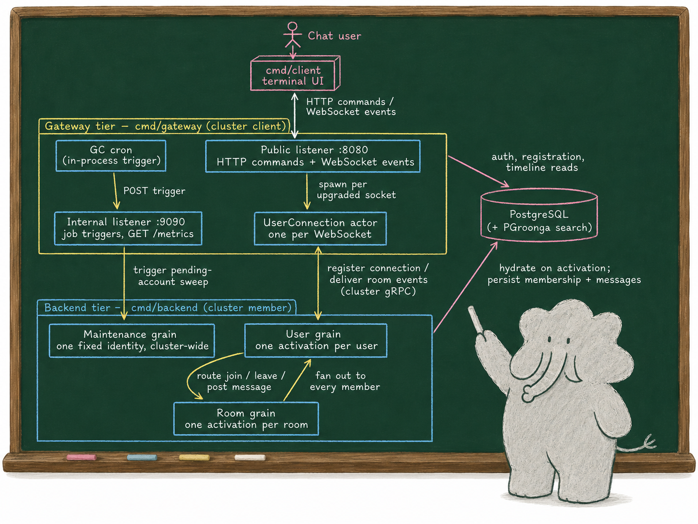

# blabby

A small, real-time group-chat system built on [Proto.Actor](https://proto.actor/) virtual actors (grains) in Go — designed to be **read**, not just run. blabby is a reference implementation that shows how the grain model maps onto identity-bearing entities (a user, a room), how a stateless gateway bridges plain HTTP/WebSocket clients to a cluster of grains, and how the pieces fit together end to end with a terminal client you can drive in a couple of minutes.

What makes it worth a look:

- **Grain-per-entity modelling.** Each user and each room is a virtual actor with single-threaded state — no locks, no shared mutable maps. Commands route through a user's own grain to room grains.
- **Guided feature tours.** Seven documents walk the Proto.Actor features and design tradeoffs the code exercises — actors and grains, supervision, lifecycle and passivation, reentrancy and timers, observability, cluster bootstrap, and roads not taken. Start at the [documentation hub](docs/README.md).
- **A clean client contract.** HTTP for commands and queries, a WebSocket for the real-time event stream, JSON on the wire, JWT for identity.
- **Decisions written down.** Non-obvious choices live in [Architecture Decision Records](docs/adr/), each with context and consequences.
- **Clone-and-run.** Generated protobuf code is committed and a terminal client ships in the same module; the only runtime dependency is PostgreSQL, started with a single `docker compose up -d postgres` — no broker, no cache.

## Architecture



A stateless **gateway** (`cmd/gateway`) fronts a cluster of grains hosted by the **backend** (`cmd/backend`): clients speak HTTP and WebSocket to the gateway, and everything behind it is actors. The two are separate binaries — the gateway joins the cluster as a *client* and hosts one `UserConnection` actor per socket, the backend joins as a *member* and hosts the `User`, `Room`, and `Maintenance` grains — so the API tier and the grain tier scale independently. Durable state lives in PostgreSQL; grain memory is a cache over it.

The [technical documentation](docs/README.md) carries the depth: the tier model with its decision records, seven guided feature tours, and the [message-flow sequence diagram](docs/overall.svg) from login through fan-out to self-healing.

## Quick Start

**Requirements:** Go 1.26 or newer, plus Docker — the backend and gateway read durable room and membership state from PostgreSQL (with the PGroonga extension), so a database must be running.

**1. Start PostgreSQL** (the `postgres` service applies the schema and dev seed on its first run; the binaries default to its connection string):

```bash
docker compose up -d postgres
```

**2. Start the backend** (the grain tier — joins the cluster as a member):

```bash
go run ./cmd/backend
```

**3. In another terminal, start the gateway** (HTTP + WebSocket on `:8080`, joins as a cluster client):

```bash
go run ./cmd/gateway
```

It defaults to joining a local backend on `127.0.0.1:6330` and logs a one-time loopback advertised-host warning — expected for a same-host run. Override `--seeds`, `--advertised-host`, and `--cluster-port` for a real cluster ([details](docs/multi-node-cluster.md)).

**4. In a third terminal, start the client:**

```bash
go run ./cmd/client --server http://localhost:8080
```

**5. Log in and chat.** The client opens a three-pane workspace with a centered sign-in modal. Sign in with one of the built-in development accounts:

| Email | Password |
|-------|----------|
| `alice@example.com` | `alice123` |
| `bob@example.com` | `bob123` |
| `charlie@example.com` | `charlie123` |

Type the email address, press `tab`, type the password, press `enter`. Then:

- Press `/` to open room search, pick a room (`general` or `random`), and join it.
- Highlight a joined room in the **Rooms** pane and press `enter` to make it active.
- Type a message and press `enter` to send. Open a second client as another user (or the same one) to watch messages arrive in real time.
- Press `ctrl+c` to quit.

That's the whole loop — from a fresh clone to exchanging messages in a few minutes across three terminals.

> The default JWT signing secret is a built-in development value (the gateway logs a warning). Pass `--jwt-secret` to the gateway (and `--listen` to change its address) for anything beyond local experimentation; every gateway in a real deployment must share the same secret.

Want to run several gateways and backends that discover each other and route messages across nodes? See [`docs/multi-node-cluster.md`](docs/multi-node-cluster.md) for a runnable walk-through.

**Metrics (optional).** Pass `--metrics` to the gateway or `--metrics-listen 127.0.0.1:9464` to the backend to expose Proto.Actor's built-in metrics as a Prometheus scrape endpoint; the [observability tour](docs/observability.md) covers what you get and how it is wired.

## Documentation

- [`docs/README.md`](docs/README.md) — the hub: architecture at a glance, seven guided tours of the Proto.Actor features this codebase exercises, and a cross-reference from the official Proto.Actor docs pages to the code that exercises each.
- [`docs/adr/`](docs/adr/) — Architecture Decision Records: the context, alternatives, and consequences behind the non-obvious choices.
- [`api/openapi.yaml`](api/openapi.yaml) and [`api/asyncapi.yaml`](api/asyncapi.yaml) — machine-readable client contracts for HTTP and WebSocket traffic; browse both locally with `make docs-preview`.
- Implementation details live in the Go docs: `go doc ./...`, or browse a package, e.g. `go doc ./internal/grain/room`.

## Development

Common tasks are wrapped in the `Makefile`:

`make spec-lint` also requires Node and `npx` on `PATH`; the other Quick Start requirements are enough to build, run, and test the Go binaries locally.

```bash
make build         # compile ./cmd/backend, ./cmd/gateway, and ./cmd/client
make test          # race-flagged suite plus the multi-member cluster test
make lint          # golangci-lint
make spec-lint     # validate the OpenAPI and AsyncAPI contracts
make docs-preview  # browse both API contracts locally
make diagrams      # render docs/*.puml to the committed SVGs (Docker)
make coverage      # test coverage report
make generate      # buf generate
```

## Code Generation

The protobuf contracts under `proto/` generate both message types and Proto.Actor grain scaffolding — interfaces, typed clients, actor wrappers — via [buf](https://buf.build/) and `protoc-gen-go-grain`. The output in `gen/` is committed, so cloning and building needs no codegen toolchain. To regenerate after editing `.proto` files:

```bash
go install github.com/asynkron/protoactor-go/protobuf/protoc-gen-go-grain@latest
buf generate && git diff --exit-code gen/   # regenerate, then verify determinism
```

## Project Structure

```
blabby/
├── cmd/
│   ├── backend/        # Grain tier — cluster member hosting the User, Room, and Maintenance grains
│   ├── gateway/        # API tier — HTTP/WebSocket front end; joins the cluster as a client
│   ├── client/         # Terminal (TUI) chat client
│   └── docs-preview/   # Local browser preview for the API contracts
├── internal/
│   ├── grain/          # User, Room, and Maintenance grain implementations
│   ├── actor/          # UserConnection actor — bridges a WebSocket to the User grain
│   ├── gateway/        # HTTP/WebSocket handlers, auth boundary, error envelope
│   ├── clusterboot/    # Cluster assembly: discovery, identity lookup, logging, telemetry wiring
│   ├── persistence/    # PostgreSQL repositories and schema (rooms, membership, messages, accounts)
│   ├── middleware/     # Receiver middleware: structured logging, death-watch translation
│   ├── supervision/    # Logging decorator over the supervisor strategies
│   ├── telemetry/      # Prometheus-backed OpenTelemetry MeterProvider
│   ├── auth/           # Authenticator interface + JWT implementation
│   ├── id/             # UserID / RoomID value types, parsed once at boundaries
│   ├── testutil/       # In-process cluster and grain test harnesses
│   └── ...             # plus focused support packages (domain types, error taxonomy, logging setup, snowflake ids)
├── proto/              # Protobuf service + message definitions
├── gen/                # Generated Go from proto (committed — clone and build)
├── api/                # API specs: openapi.yaml (HTTP) + asyncapi.yaml (WebSocket)
└── docs/               # Technical hub, feature tours, rendered diagrams, and ADRs
```

## Related Reading & Examples

Writing and small example repositories by the maintainer on protoactor-go's building blocks. The dates matter: the older posts describe the API names of their day (`Context.Tell` has since become `Send`), while the mechanics they explain still hold.

- [Introduction to golang's actor model implementation](https://blog.oklahome.net/2018/07/protoactor-go-introduction.html) (2018) — terminology, concepts, and constructing your first actors.
- [How actors communicate with each other](https://blog.oklahome.net/2018/09/protoactor-go-messaging-protocol.html) (2018) — the messaging methods and what each guarantees.
- [How actor.Future works to synchronize concurrent task execution](https://blog.oklahome.net/2018/11/protoactor-go-how-future-works.html) (2018) — futures, `PipeTo`, and awaiting inside an actor.
- [How middleware works to intercept incoming and outgoing messages](https://blog.oklahome.net/2018/11/protoactor-go-middleware.html) (2018) — the interception points this repo's logging middleware builds on.
- [Use plugins to add behaviors to an actor](https://blog.oklahome.net/2018/12/protoactor-go-use-plugin-to-add-behavior.html) (2018) — composing reusable capabilities from middleware.
- [How proto.actor's clustering works to achieve higher availability](https://blog.oklahome.net/2021/05/protoactor-clustering.html) (2021) — the clustering model this repo's gateway/backend split rides on.

Focused example repositories, each isolating one mechanism in a few files:

- [protoactor-go-sender-example](https://github.com/oklahomer/protoactor-go-sender-example) — how an actor resolves the sender to reply to.
- [protoactor-go-future-example](https://github.com/oklahomer/protoactor-go-future-example) — future handling patterns.
- [protoactor-go-middleware-example](https://github.com/oklahomer/protoactor-go-middleware-example) — middleware in isolation.
