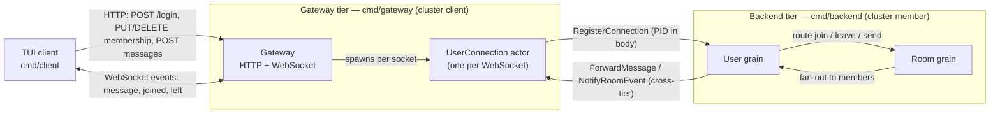

# blabby

A small, real-time group-chat system built on [Proto.Actor](https://proto.actor/) virtual actors (grains) in Go — designed to be **read**, not just run. blabby is a reference implementation that shows how the grain model maps onto identity-bearing entities (a user, a room), how a stateless gateway bridges plain HTTP/WebSocket clients to a cluster of grains, and how the pieces fit together end to end with a terminal client you can drive in a couple of minutes.

What makes it worth a look:

- **Grain-per-entity modelling.** Each user and each room is a virtual actor with single-threaded state — no locks, no shared mutable maps. Commands route through a user's own grain to room grains.
- **A clean client contract.** HTTP for commands and queries, a WebSocket for the real-time event stream, JSON on the wire, JWT for identity.
- **Decisions written down.** Non-obvious choices live in [Architecture Decision Records](docs/adr/), each with context and consequences.
- **Clone-and-run.** Generated protobuf code is committed and a terminal client ships in the same module; the only runtime dependency is PostgreSQL, started with a single `docker compose up -d postgres` — no broker, no cache.

## Architecture

A stateless **gateway** (`cmd/gateway`) fronts a cluster of grains hosted by the **backend** (`cmd/backend`). Clients speak HTTP + WebSocket to the gateway; everything behind it is actors. The two are separate binaries: the gateway joins the cluster as a *client* (it calls grains but hosts none), the backend joins as a *member* (it hosts the grains), so the API tier and the grain tier scale independently.



- **Gateway** (`cmd/gateway`) — translates client JSON/WebSocket frames to and from grain calls, validates JWTs, and shapes structured error responses. It joins the cluster as a client and hosts the per-connection UserConnection actors.
- **UserConnection actor** — one per WebSocket connection; it authenticates, registers itself with the user's grain, and writes events back to the socket. It is a regular actor, not a grain.
- **User grain** (`cmd/backend`) — a user's agent inside the cluster: it holds the set of that user's live connections and routes the user's commands to room grains.
- **Room grain** (`cmd/backend`) — owns room membership and the message pipeline; it stamps each message with a server timestamp and fans events out to every member (the sender included, so other devices echo).

For a deeper view, see [`docs/overall.puml`](docs/overall.puml) (component diagram) and [`docs/userconnection_design_en.md`](docs/userconnection_design_en.md) (the connection lifecycle).

## API Contracts

The client-facing contracts are defined by [`api/openapi.yaml`](api/openapi.yaml) for HTTP commands and queries and [`api/asyncapi.yaml`](api/asyncapi.yaml) for the WebSocket event stream.

To browse both contracts from one local landing page, run:

```bash
make docs-preview
```

Then open [http://localhost:8081](http://localhost:8081). The preview requires Node.js and `npx`; it uses the same Redocly and AsyncAPI CLI packages as `make spec-lint`, downloading them into the npm cache on first use. No generated documentation is written into the repository.

Override the two local ports when needed:

```bash
DOCS_PORT=9081 ASYNCAPI_PORT=9082 make docs-preview
```

## Quick Start

**Requirements:** Go 1.26 or newer, plus Docker — the backend and gateway read durable room and membership state from PostgreSQL (with the PGroonga extension), so a database must be running.

**1. Start PostgreSQL** (the `postgres` service applies the schema and dev seed on its first run; the binaries default to its connection string):

```bash
docker compose up -d postgres
```

**2. Start the backend** (the grain tier — joins the cluster as a member):

```bash
go run ./cmd/backend
```

**3. In another terminal, start the gateway** (HTTP + WebSocket on `:8080`, joins as a cluster client):

```bash
go run ./cmd/gateway
```

It defaults to joining a local backend on `127.0.0.1:6330` and logs a one-time loopback advertised-host warning — expected for a same-host run. Override `--seeds`, `--advertised-host`, and `--cluster-port` for a real cluster ([details](docs/multi-node-cluster.md)).

**4. In a third terminal, start the client:**

```bash
go run ./cmd/client --server http://localhost:8080
```

**5. Log in and chat.** The client opens a three-pane workspace with a centered sign-in modal. Sign in with one of the built-in development accounts:

| Username | Password |
|----------|-----------|
| `alice`  | `alice123`  |
| `bob`    | `bob123`    |
| `charlie`| `charlie123`|

Type the username, press `tab`, type the password, press `enter`. Then:

- Press `/` to open room search, pick a room (`general` or `random`), and join it.
- Highlight a joined room in the **Rooms** pane and press `enter` to make it active.
- Type a message and press `enter` to send. Open a second client as another user (or the same one) to watch messages arrive in real time.
- Press `ctrl+c` to quit.

That's the whole loop — from a fresh clone to exchanging messages in a few minutes across three terminals.

> The default JWT signing secret is a built-in development value (the gateway logs a warning). Pass `--jwt-secret` to the gateway (and `--listen` to change its address) for anything beyond local experimentation; every gateway in a real deployment must share the same secret.

Want to run several gateways and backends that discover each other and route messages across nodes? See [`docs/multi-node-cluster.md`](docs/multi-node-cluster.md) for a runnable walk-through.

## Project Structure

```
blabby/
├── cmd/
│   ├── backend/        # Grain tier — cluster member hosting the User and Room grains
│   ├── gateway/        # API tier — HTTP/WebSocket front end; joins the cluster as a client
│   ├── client/         # Terminal (TUI) chat client
│   └── docs-preview/   # Local browser preview for the API contracts
├── internal/
│   ├── grain/
│   │   ├── user/       # User grain — connection set + command routing
│   │   └── room/       # Room grain — membership + message fan-out
│   ├── actor/
│   │   └── connection/ # UserConnection actor — bridges a WebSocket to the User grain
│   ├── gateway/        # HTTP/WebSocket gateway, auth middleware, error envelope
│   ├── auth/           # Authenticator interface + JWT impl + in-memory user store
│   ├── id/             # UserID / RoomID value types, parsed once at boundaries
│   ├── logging/        # slog JSON setup
│   ├── middleware/     # Receiver middleware for structured grain/actor logging
│   ├── persistence/    # Placeholder for a future durable store (not wired yet)
│   └── testutil/
│       ├── grain/      # Grain unit-test helpers (fake grain context, etc.)
│       └── cluster/    # In-process test cluster bootstrap
├── proto/              # Protobuf service + message definitions
├── gen/                # Generated Go from proto (committed — clone and build)
├── api/                # API specs: openapi.yaml (HTTP) + asyncapi.yaml (WebSocket)
└── docs/
    └── adr/            # Architecture Decision Records
```

## Code Generation

blabby uses [buf](https://buf.build/) to orchestrate protobuf code generation with two plugins:

1. **`buf.build/protocolbuffers/go`** generates Go structs for protobuf messages (`.pb.go` files).
2. **`protoc-gen-go-grain`** generates Proto.Actor grain interfaces, clients, and actor wrappers (`_grain.pb.go` files) from `service` definitions.

The generated code in `gen/` is committed, so you can clone and build without running code generation locally.

To regenerate after editing `.proto` files you need the [buf](https://buf.build/docs/installation/) CLI and the grain plugin:

```bash
go install github.com/asynkron/protoactor-go/protobuf/protoc-gen-go-grain@latest
buf generate
```

The output is deterministic; verify it matches what's committed with:

```bash
buf generate && git diff --exit-code gen/
```

## Development

Common tasks are wrapped in the `Makefile`:

```bash
make build         # compile ./cmd/backend, ./cmd/gateway, and ./cmd/client
make test          # go test ./...
make lint          # golangci-lint
make spec-lint     # validate the OpenAPI and AsyncAPI contracts
make docs-preview  # browse both API contracts locally
make coverage      # test coverage report
make generate      # buf generate
```

## Learn More

- [`docs/adr/`](docs/adr/) — Architecture Decision Records explaining the major design choices and their trade-offs.
- [`api/openapi.yaml`](api/openapi.yaml) and [`api/asyncapi.yaml`](api/asyncapi.yaml) — machine-readable client contracts for HTTP and WebSocket traffic.
- Implementation details live in the Go docs: `go doc ./...`, or browse a package, e.g. `go doc ./internal/grain/room`.
