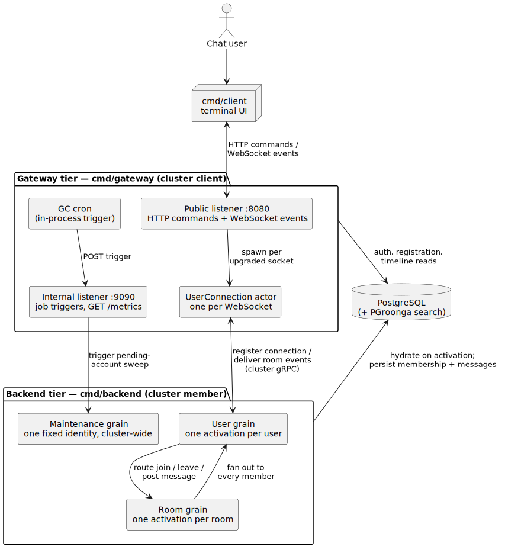

# blabby technical documentation

This directory is the hands-on companion to the codebase. It has three
layers: the architecture on this page, guided tours of the Proto.Actor
features the code exercises, and the decision records in [`adr/`](adr/) that
carry the full reasoning. Every claim links into code you can run and read.

If you have not started the system yet, the
[top-level README](../README.md#quick-start) gets you from a fresh clone to
exchanging messages in a few minutes.

## Architecture at a glance

Two binaries share one Proto.Actor cluster and split the work by tier
([ADR-016](adr/adr-016-gateway-backend-tier-separation.md)). The **gateway**
(`cmd/gateway`) joins the cluster as a *client*: it terminates HTTP and
WebSocket traffic, validates JWTs, and hosts one `UserConnection` actor per
socket, but hosts no grains. The **backend** (`cmd/backend`) joins as a
*member* and hosts the grains: one `User` grain per user identity, one `Room`
grain per room, and a single fixed-identity `Maintenance` grain for periodic
jobs. The two tiers scale independently, and every hop between them rides
Proto.Actor's gRPC remote.

State lives in PostgreSQL. The User and Room grains hydrate their durable
state from it on activation and treat the in-memory copy as a cache over
the database
([ADR-007](adr/adr-007-database-authoritative-persistence.md)), so an
activation can passivate, move to another member, and pick up where it
left off.

A message's full journey, from login through fan-out to disconnect and
self-healing, is drawn in the [message-flow sequence diagram](overall.svg)
(source: [`overall.puml`](overall.puml)). Two companion walk-throughs go
deeper: [`multi-node-cluster.md`](multi-node-cluster.md) runs several
gateways and backends that discover each other, and
[`userconnection_design_en.md`](userconnection_design_en.md) covers the
connection lifecycle design.

## Feature tours

Each tour follows one theme through the codebase: what the Proto.Actor
feature does, where blabby uses it, why it took that shape, and a hands-on
step you can run. Tours land one pull request at a time; names below become
links as each file arrives.

| Tour | Proto.Actor features | Key code |
|---|---|---|
| [actors-and-grains.md](actors-and-grains.md) | regular actors, virtual actors (grains), PIDs vs identities, grain codegen, typed clients | `internal/actor/connection`, `internal/grain/` |
| [supervision.md](supervision.md) | guardians, supervisor strategies, directives | `internal/supervision`, `internal/grain/room/supervision.go` |
| [lifecycle-and-passivation.md](lifecycle-and-passivation.md) | death watch, `Terminated`, passivation, `Stop` vs `Poison` | `internal/grain/user`, `internal/middleware/terminated.go` |
| [reentrancy-and-timers.md](reentrancy-and-timers.md) | `ReenterAfter`, futures, `TimerScheduler` | `internal/grain/maintenance`, `internal/actor/connection` |
| [observability.md](observability.md) | EventStream, dead letters, throttle, logger factory, metrics | `internal/clusterboot`, `internal/telemetry`, `internal/middleware` |
| [cluster-bootstrap.md](cluster-bootstrap.md) | member vs client, automanaged provider, disthash, remote | `internal/clusterboot` |
| roads-not-taken.md | pub-sub, routers, Proto.Persistence, receive-timeout, mailboxes | comparisons rather than tours |

## Design decisions

The tours keep their "why" sections short and hand the depth to the
[Architecture Decision Records](adr/): context, alternatives weighed, and
consequences accepted. For the actor-model core, a useful first read is
[ADR-001](adr/adr-001-grain-topology.md) (grain topology),
[ADR-012](adr/adr-012-watch-based-connection-lifecycle.md) (watch-based
connection lifecycle),
[ADR-015](adr/adr-015-command-query-vs-notification.md) (the fan-out child),
and [ADR-017](adr/adr-017-supervision-strategy.md) (supervision strategy).

## API contracts

The client-facing contracts are machine-readable:
[`api/openapi.yaml`](../api/openapi.yaml) for HTTP commands and queries,
[`api/asyncapi.yaml`](../api/asyncapi.yaml) for the WebSocket event stream.
Browse both locally with `make docs-preview`.

## Official Proto.Actor references

The jump table for readers arriving from the
[official documentation](https://proto.actor/docs/ProtoActor/): each row
pairs a Proto.Actor docs page with the place blabby exercises that feature.

| Official page | Where blabby exercises it |
|---|---|
| [actors](https://proto.actor/docs/ProtoActor/actors), [props](https://proto.actor/docs/ProtoActor/props), [spawn](https://proto.actor/docs/ProtoActor/spawn), [pid](https://proto.actor/docs/ProtoActor/pid) | `internal/actor/connection`, spawned per socket in `internal/gateway` |
| [behaviors](https://proto.actor/docs/ProtoActor/behaviors) | the `UserConnection` state machine (pre-auth, post-auth, closing) |
| [reenter](https://proto.actor/docs/ProtoActor/reenter), [futures](https://proto.actor/docs/ProtoActor/futures) | `internal/grain/maintenance`: grain awaits its sweep worker |
| [supervision](https://proto.actor/docs/ProtoActor/supervision) | `internal/supervision`, `internal/grain/room/supervision.go` |
| [middleware](https://proto.actor/docs/ProtoActor/middleware) | `internal/middleware`: logging, death-watch translation, auth timeout |
| [receive-timeout](https://proto.actor/docs/ProtoActor/receive-timeout) | grain passivation in the generated code (`gen/*_grain.pb.go`) |
| [scheduling](https://proto.actor/docs/ProtoActor/scheduling) | connection auth deadline and heartbeats (`internal/actor/connection`) |
| [eventstream](https://proto.actor/docs/ProtoActor/eventstream), [deadletter](https://proto.actor/docs/ProtoActor/deadletter) | `internal/clusterboot/topology.go`, `internal/clusterboot/deadletter.go` |
| [metrics](https://proto.actor/docs/ProtoActor/metrics), [logging](https://proto.actor/docs/ProtoActor/logging) | `internal/telemetry`, the logger factory in `internal/clusterboot/bootstrap.go` |
| [remote](https://proto.actor/docs/ProtoActor/remote), [serialization](https://proto.actor/docs/ProtoActor/serialization) | `clusterboot.Build`, the proto contracts under `proto/` |
| [cluster](https://proto.actor/docs/ProtoActor/cluster), [virtual actors (Go)](https://proto.actor/docs/ProtoActor/cluster/virtual-actors-go) | `internal/grain/`, `internal/clusterboot` |
| [deadlocks](https://proto.actor/docs/ProtoActor/deadlocks) | the Room grain's fan-out child ([ADR-015](adr/adr-015-command-query-vs-notification.md)) |
| [backpressure](https://proto.actor/docs/ProtoActor/backpressure) | the connection's bounded outbound channel |
