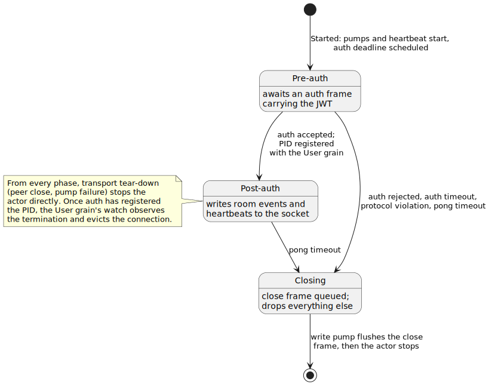

# Actors and grains, side by side

blabby runs both of Proto.Actor's actor models in one system and wires them
together. `UserConnection` is a regular actor whose lifetime is one WebSocket
connection. `UserGrain` is a virtual actor (a *grain*) whose lifetime the
cluster manages for you. Reading the two side by side shows what each model
buys, and the seam where they meet carries most of the interesting
engineering.

## A regular actor: UserConnection

A regular actor is a mailbox, a `Receive` function, and a PID. You spawn it,
you address it by that PID, and it lives until something stops it. Official
pages: [actors](https://proto.actor/docs/ProtoActor/actors),
[props](https://proto.actor/docs/ProtoActor/props),
[spawn](https://proto.actor/docs/ProtoActor/spawn),
[pid](https://proto.actor/docs/ProtoActor/pid).

The gateway spawns one `UserConnection` per upgraded WebSocket from the root
context (`internal/gateway/handler_ws.go`). Its props
(`internal/actor/connection/connection.go`, `NewProps`) compose three
Proto.Actor features: a producer closure capturing the socket, receiver
middleware for the auth deadline and structured logging, and a guardian
supervisor, because root-spawned actors have no parent to supervise them
(the supervision tour covers that half).

The actor's life is a three-phase state machine built on
[behaviors](https://proto.actor/docs/ProtoActor/behaviors):



`actor.Behavior` swaps the active `Receive` function with `Become`, so the
phase is encoded in dispatch rather than in a mode field the code must check
everywhere. One house rule keeps the machine readable: only the major
receive methods call `Become`. Helpers validate and report outcomes; the
dispatch site decides what phase comes next. Scan `preAuthBehavior` in
`connection.go` and every transition is visible in one screen.

Why this shape: the actor's lifetime *is* the socket's lifetime. When the
peer disconnects, the actor stops; there is nothing to passivate, cache, or
restore. Transport I/O lives in two pump goroutines that translate socket
reads and write results into plain messages, so the actor itself never
blocks on the network.

## A virtual actor: UserGrain

A grain is addressed by a string identity, never by PID. The cluster
activates it on the first message, places it on whichever member the
identity hashes to, and deactivates it when idle. Official pages:
[cluster](https://proto.actor/docs/ProtoActor/cluster),
[virtual actors (Go)](https://proto.actor/docs/ProtoActor/cluster/virtual-actors-go),
[getting started (Go)](https://proto.actor/docs/ProtoActor/cluster/getting-started-go).

blabby hosts three kinds, assembled in `internal/clusterboot/bootstrap.go`
(`Kinds`): a `User` grain per user (`internal/grain/user`), a `Room` grain
per room (`internal/grain/room`), and one `Maintenance` grain (below). User
and Room activations hydrate their durable state from PostgreSQL and treat
memory as a cache over the database
([ADR-007](adr/adr-007-database-authoritative-persistence.md)), which is
what makes deactivation and relocation safe. One deliberate exception: the
User grain's set of live connection PIDs is memory-only, built by
connections registering themselves during authentication (the seam section
below); after a relocation, the watch each side keeps on the other lets
live connections re-register with the fresh activation on their own
([ADR-006](adr/adr-006-bidirectional-watch-pattern.md)). The
Maintenance grain keeps no
activation state at all; it is a fixed-identity coordinator that drives
database work through an injected sweeper.

Why this shape: one activation per identity means all of a user's (or
room's) state is behind one single-threaded mailbox, cluster-wide. No locks,
no shared maps, no cross-node cache coherence; the cluster's identity
ownership does the serialization
([ADR-001](adr/adr-001-grain-topology.md)).

## Grain codegen and typed clients

blabby does not hand-write grain plumbing. Proto service definitions under
`proto/` feed `protoc-gen-go-grain` (via `buf generate`), which emits the
grain interface, an actor wrapper, and a typed client per service into
`gen/*_grain.pb.go`. A kind constructor in each grain package wraps the
generated one and pins its policies, passivation timeout included:

```go
return userpb.NewUserGrainKind(func() userpb.UserGrain {
    return &Grain{directory: cfg.dir, joinedLoader: cfg.joinedLoader}
}, passivationTimeout, ...)
```

Callers never touch PIDs for grain calls. They ask the generated client for
an identity and invoke a method,
`roompb.GetRoomGrainGrainClient(c, roomID.String()).Join(req)`
(`internal/grain/user/room_client.go`), and the cluster resolves where that
identity lives right now.

One quirk to know before reading generated code: the generated dispatch
discards Proto.Actor system messages before they reach `ReceiveDefault`,
which matters the moment a grain needs death watch. The
lifecycle-and-passivation tour covers the shim blabby installs for that.

## Where the two models meet

After authentication, the connection actor registers itself with its user's
grain by sending `RegisterConnection` with its own PID inside the payload
(`internal/actor/connection/cluster_client.go`). The grain stores that PID
and, when a room fans out an event, sends it straight back across the
cluster's gRPC remote to the socket-bound actor. A PID in a message body
resolves on any member because it carries the remote address the owning node
advertises ([ADR-011](adr/adr-011-cross-boundary-pid-propagation.md)); the
cluster-bootstrap tour explains the plumbing.

There is no deregistration RPC. The grain watches the PID and evicts it when
the actor terminates
([ADR-012](adr/adr-012-watch-based-connection-lifecycle.md)), which is the
subject of the lifecycle-and-passivation tour.

## One identity as a cluster-wide singleton

Virtual actors give you a singleton for free: address every request to the
same fixed identity and the cluster guarantees at most one activation.
blabby's maintenance grain does exactly this with
`PendingAccountGCIdentity` (`internal/grain/maintenance/maintenance.go`),
turning "run this periodic job exactly once across the cluster" into plain
grain addressing, with in-grain coalescing for overlapping triggers
([ADR-021](adr/adr-021-scheduled-maintenance-jobs.md)).

## Try it

Run the [quick start](../README.md#quick-start) with two client terminals
and read the log streams while you sign in and chat:

- The gateway logs `gateway.ws.upgraded` with a fresh PID per client: two
  sockets, two regular actors.
- The backend logs `grain.activated` the first time each identity is
  touched: your User grain on sign-in, the Room grain on first join. Sign in
  as the same user twice and no second activation appears; both connections
  registered with the one grain.
- Send a message and watch one `Room` grain fan out to both connections'
  PIDs through their User grains.
- Leave both clients idle and `grain.passivated` lines show the cluster
  reclaiming the idle activations on each kind's own clock (two minutes for
  a User grain, five for a Room); the sockets' actors stay, because their
  lifetime is the connection, not an idle timer.
