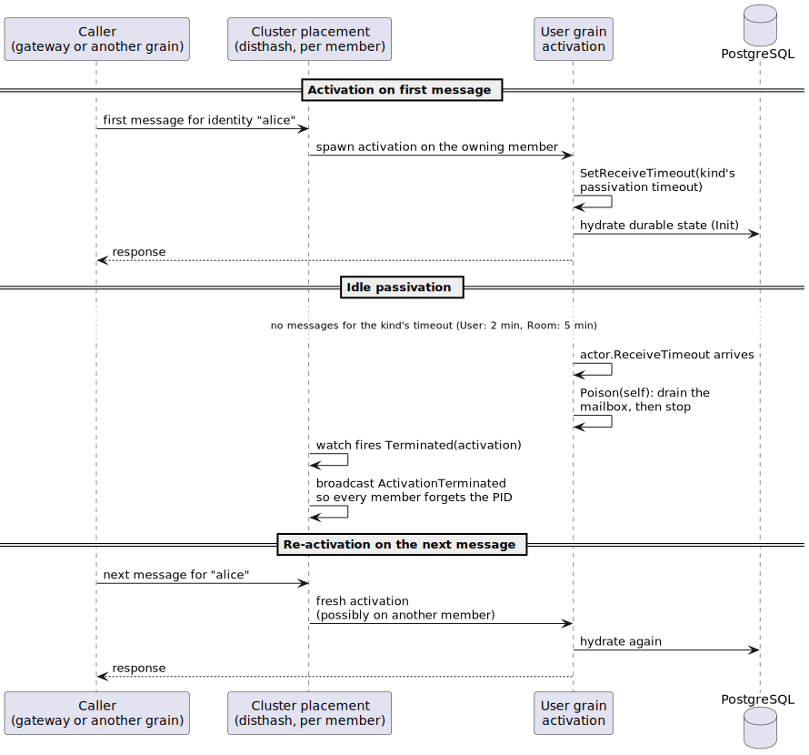

# Lifecycle: death watch, Terminated, and passivation

Actors end, on purpose or otherwise, and other actors need to find out.
This tour covers the two lifecycle mechanisms blabby leans on: death watch,
which turns one actor's termination into a message another actor can act
on, and passivation, which lets idle grains leave memory on their own.
Official pages: [life-cycle](https://proto.actor/docs/ProtoActor/life-cycle),
[supervision](https://proto.actor/docs/ProtoActor/supervision) (watch shares
its machinery),
[receive-timeout](https://proto.actor/docs/ProtoActor/receive-timeout).

## Death watch across the grain boundary

`ctx.Watch(pid)` asks the runtime to deliver `*actor.Terminated` when the
watched actor stops, however it stops: clean shutdown, panic, or its node
disappearing. The User grain watches every connection PID it registers
(`internal/grain/user/user.go`, `RegisterConnection`) and evicts the entry
when the notification arrives, so fan-outs never target a dead socket.
There is no Deregister RPC; the watch *is* the lifecycle contract
([ADR-012](adr/adr-012-watch-based-connection-lifecycle.md)).

The watch is bidirectional
([ADR-006](adr/adr-006-bidirectional-watch-pattern.md)): the connection
actor watches its grain's activation in return, and when the activation
dies (passivation racing a delivery, a member lost), the connection
re-registers with the fresh activation, wherever the cluster placed it.
Each side heals independently with the same primitive; each knows exactly
one repair action, evict or re-register.


## The TranslateTerminated shim

A quirk every grain author hits eventually: the generated grain dispatch
discards Proto.Actor system messages before `ReceiveDefault`, and
`*actor.Terminated` is a system message. A grain that relies on death watch
would never see its notifications. blabby's answer is a receiver middleware,
`TranslateTerminated` (`internal/middleware/terminated.go`), that re-wraps
the notification as a plain struct which falls through the generated switch:

```go
if t, ok := env.Message.(*actor.Terminated); ok {
    next(ctx, &actor.MessageEnvelope{
        Header:  env.Header,
        Message: &WatchedTerminated{Who: t.Who, Why: t.Why},
        Sender:  env.Sender,
    })
    return
}
```

The User grain's `ReceiveDefault` then handles `*WatchedTerminated` like
any other message (`user.go`, with the eviction logged as
`grain.connection.terminated`). Install order matters: the shim runs ahead
of the logging middleware so the log stream records the message the grain
actually receives.

## Passivation: idle grains leave on their own

A grain that nobody messages should not occupy memory forever. The
generated kind constructor takes a passivation timeout, and the generated
actor wires it with two of the runtime's primitives: `SetReceiveTimeout`
on start, and `Poison(self)` when `*actor.ReceiveTimeout` fires. The
cluster's placement machinery watches every activation, so the
self-inflicted stop broadcasts `ActivationTerminated` and every member
forgets the PID; the next message for that identity activates fresh,
possibly on another member.



Each kind picks its own timeout, and the values are policy, not folklore:

| Grain | Timeout | Why |
|---|---|---|
| Room | 5 min (`internal/grain/room/room.go`) | holds the recent-message buffer; staying warm is worth more memory |
| User | 2 min (`internal/grain/user/user.go`) | no history to keep; cheap to rebuild from the database |
| Maintenance | never (`internal/grain/maintenance/maintenance.go`) | one fixed system identity; must not die mid-sweep |

Passivation is safe because activations hydrate durable state from
PostgreSQL ([ADR-007](adr/adr-007-database-authoritative-persistence.md))
and the connection set heals through the bidirectional watch above. For
hand-written actors the module offers `plugin.PassivationPlugin`; blabby's
`UserConnection` deliberately has no idle timeout, because its lifetime is
the socket, not a timer.

## Stop vs Poison

Two ways to end an actor, one distinction: `Stop` halts after the current
message; `Poison` enqueues like a normal message, so everything already in
the mailbox drains first. blabby uses both deliberately: the sweep worker
`Stop`s itself after replying (nothing else should run), while generated
passivation `Poison`s so in-flight messages finish before the activation
disappears. The connection actor's close path is `Stop`-based: by the time
it stops, the closing behavior has already drained what matters, the close
frame, through the write pump.

## Try it

- Kill a connected client (`ctrl+c` in its terminal) and watch the backend
  log `grain.connection.terminated` as the User grain's watch evicts the
  dead PID, no deregistration traffic anywhere.
- Stay idle and watch `grain.passivated` arrive on each kind's clock: the
  User grain two minutes after its last message, the Room grain five.
- Then send a message to the same room and watch `grain.activated` fire
  again for both identities: same identity, fresh activation, state
  rehydrated from PostgreSQL.
