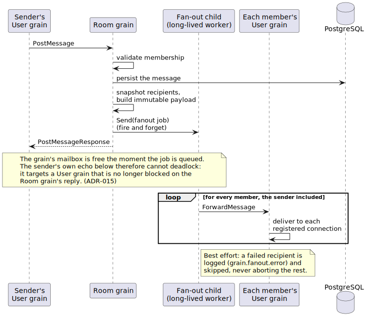

# Reentrancy and timers: waiting without blocking

An actor that blocks its mailbox blocks everyone behind it, and an actor
that waits synchronously on another actor invites deadlock. This tour
covers blabby's two answers: reentrant continuations for awaiting work, and
timers that arrive as ordinary messages.

## ReenterAfter: awaiting a child without holding the mailbox

`ctx.ReenterAfter` registers a continuation against a future; when the
future completes, the continuation runs back on the actor's own context,
with the mailbox free in between. Official pages:
[reenter](https://proto.actor/docs/ProtoActor/reenter),
[futures](https://proto.actor/docs/ProtoActor/futures).

The Maintenance grain is the working example
(`internal/grain/maintenance/maintenance.go`). A sweep trigger spawns a
one-shot worker, requests it with a future, and reenters:

```go
worker := ctx.Spawn(actor.PropsFromProducer(func() actor.Actor {
    return newSweepWorker(g.sweeper, g.now, g.dbTimeout)
}))
future := ctx.RequestFuture(worker, runSweep{}, g.futureTimeout)
ctx.ReenterAfter(future, func(res any, err error) {
    g.running = false
    g.logOutcome(ctx, res, err)
})
```

Three details carry the design:

- The continuation runs on the grain's context, so touching `g.running`
  needs no locks; the single-threaded guarantee holds across the wait.
- The continuation runs on success, failure, or timeout alike, so the
  coalescing flag can never stick; a hung worker cannot wedge the job.
- The two timeouts are ordered on purpose: the worker's database context
  (30s) expires before the actor-level future (45s), so a slow sweep
  reports its own error rather than being cut off mid-flight by the grain.

The worker itself (`worker.go`) replies through `ctx.Respond` and stops;
its supervisor stops rather than restarts it, for reasons the
[supervision tour](supervision.md) covers.

## The fan-out child: designing a deadlock away

Room fan-out includes the sender: the acting user's own User grain receives
the echo, which is how a second device sees its own messages. Run that
fan-out inline in the Room grain's handler and the system deadlocks: the
echo targets the User grain that is still blocked waiting for the Room
grain's reply. Official page:
[deadlocks](https://proto.actor/docs/ProtoActor/deadlocks).

blabby's answer is a long-lived child actor
(`internal/grain/room/fanout.go`) that performs the per-member RPCs off the
grain's message goroutine:



The job the grain hands over is self-contained: a snapshot of the recipient
list, an already-built immutable payload, and the log-context strings, so
the child never reads grain state from its own goroutine. Delivery is best
effort; a failed recipient logs `grain.fanout.error` and never blocks the
rest. The child restarts in place after a panic, keeping its PID and
remaining mailbox (the [supervision tour](supervision.md) explains why the
restart budget is unlimited).
[ADR-015](adr/adr-015-command-query-vs-notification.md) carries the full
design, and roads-not-taken.md compares it with cluster pub-sub.

## TimerScheduler: timers as ordinary messages

`scheduler.NewTimerScheduler` delivers ticks into the mailbox, so timeout
handling shares the actor's single thread: no `time.AfterFunc` racing
`Receive`, no mutex around "did it fire?". Official page:
[scheduling](https://proto.actor/docs/ProtoActor/scheduling).

The connection actor runs three timers this way:

- **Auth deadline** — a middleware schedules a one-shot
  `AuthTimeoutExpired` at spawn (`internal/actor/connection/auth_timeout.go`).
  The timer fires unconditionally and the receiving behavior decides
  whether it still matters: pre-auth closes the connection, post-auth
  ignores the stale tick. Not cancelling on success is deliberate
  simplicity.
- **Heartbeat ping** — `SendRepeatedly` emits `AppPingTick` on a fixed
  interval (`heartbeat.go`); the shipped gateway pings every 30 seconds.
- **Pong watchdog** — a one-shot `PongTimeoutExpired` (75 seconds in the
  shipped gateway), armed by the first unanswered ping and re-armed only by
  a pong. The `ensureWatchdog` / `resetWatchdog` split means one watchdog
  spans consecutive unanswered pings instead of each ping pushing the
  deadline out.

One subtlety in `heartbeat.go`'s doc comment repays reading: the cancel
handles live on per-actor state, not in middleware closures, because
protoactor composes a Props' middleware chain once per Props; closure state
there would be shared by every actor the Props produces.

## Why the auth deadline is not a receive-timeout

`ctx.SetReceiveTimeout` looks like the native fit, but its clock resets on
*every* message, and the auth deadline is a hard wall clock: five seconds
to present a token, regardless of other traffic. The one-shot timer
enforces exactly that. Receive-timeout is the right tool for idle
detection, which is where the generated grain code uses it (see the
[lifecycle-and-passivation tour](lifecycle-and-passivation.md)).

## Try it

- Trigger the pending-account sweep twice in quick succession against the
  gateway's internal listener:
  `curl -i -X POST localhost:9090/internal/jobs/pending-account-gc`, twice.
  The first answers `202` and the backend logs
  `maintenance.pending_account_gc.swept` when the continuation runs; a
  second call while the sweep is in flight answers `200` with
  `"reason":"already_running"`, the coalescing flag at work.
- Open a raw WebSocket to the gateway (`/ws`) and send nothing: the auth
  deadline closes it after five seconds with an auth-timeout error frame.
